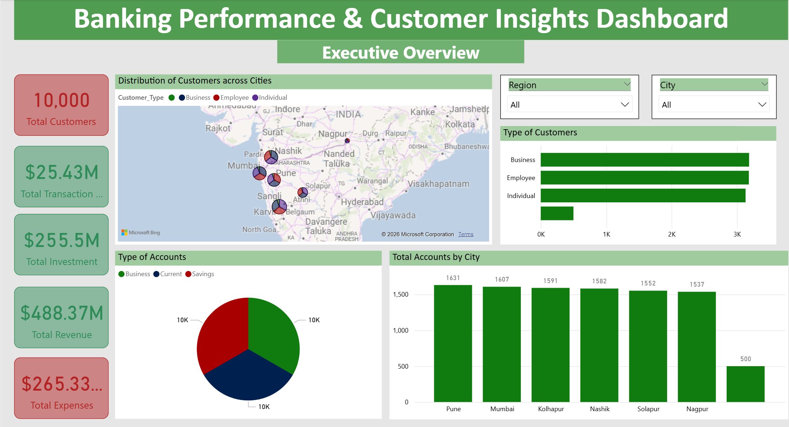
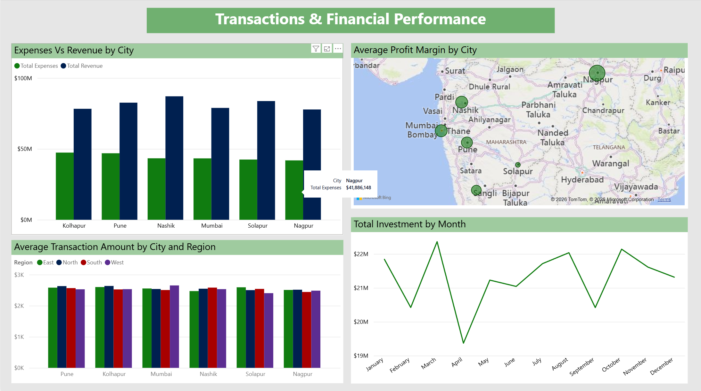
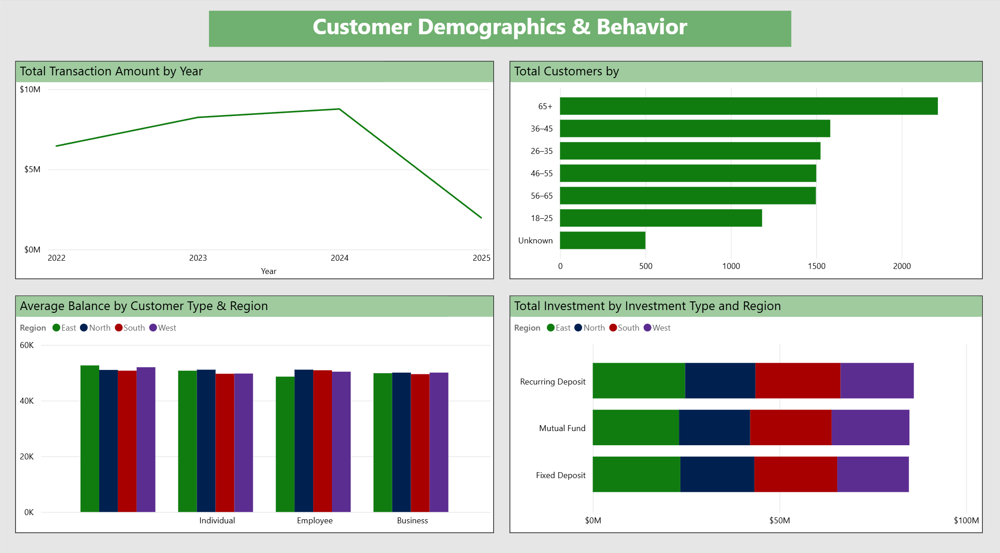

# 🏦 Banking Performance & Customer Insights Dashboard

## 📌 Project Overview
This project presents a multi-page Power BI dashboard designed to analyze retail banking performance, customer demographics, transaction behavior, and branch-level financial metrics.  

The objective was to simulate a real-world banking analytics environment and build a decision-ready reporting solution.

## 📊 Dashboard Pages

### 1️⃣ Executive Overview
- Total Customers
- Total Transactions
- Total Investments
- Revenue & Expenses KPIs
- Regional Distribution
- Branch Performance Comparison

### 2️⃣ Customer Demographics & Behavior
- Age Bucket Analysis
- Customer Type Segmentation
- Regional Customer Distribution
- Customer Engagement Insights

### 3️⃣ Transactions & Financial Performance
- Transaction Trends Over Time
- Investment Analysis
- Revenue vs Expenses Comparison
- Branch-Level Profitability Analysis

## 🛠 Tools & Techniques Used
- Power BI
- Data Modeling (Star Schema)
- DAX Measures & Calculated Columns
- KPI Conditional Formatting
- Interactive Filtering & Slicers

## 🧠 Business Questions Answered
- Which customer segments drive the most value?
- Which regions have the highest concentration of customers?
- How do transaction and investment trends evolve over time?
- Which branches are most profitable?

## 📷 Dashboard Preview

## 📂 Files Included
- `Banking Performance & Customer Insights Dashboard.pbix`
- Dashboard screenshots
- Datasets
